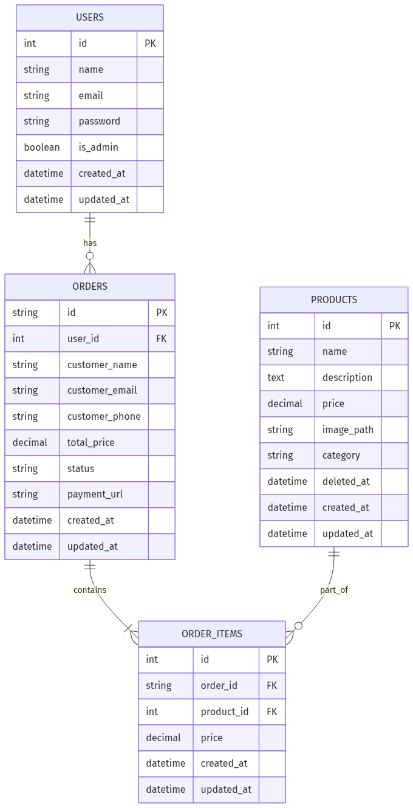
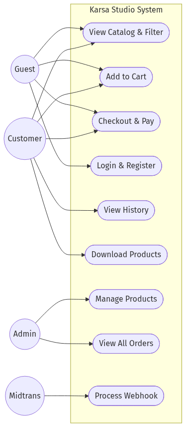

# System Diagrams

Berikut adalah Entity Relationship Diagram (ERD) dan Use Case Diagram untuk aplikasi Karsa Studio. 

## Entity Relationship Diagram (ERD)

Diagram ini menunjukkan struktur tabel di dalam database beserta relasi antar tabel.

**Penjelasan Relasi Database:**
- **USERS ke ORDERS (1 to Many):** Satu pengguna (User) dapat memiliki banyak pesanan (Order).
- **ORDERS ke ORDER_ITEMS (1 to Many):** Satu pesanan (Order) dapat memiliki lebih dari satu item yang dibeli (OrderItem).
- **PRODUCTS ke ORDER_ITEMS (1 to Many):** Satu produk (Product) dapat dibeli berulang kali, sehingga muncul di banyak OrderItem.

---

## Use Case Diagram

Diagram ini menunjukkan aktor-aktor yang terlibat dalam aplikasi beserta fitur (Use Case) yang dapat mereka gunakan.

**Penjelasan Aktor:**
1. **Guest (Pengunjung Biasa):** Dapat melihat katalog produk, filter produk, menambah ke keranjang, dan melakukan *checkout* (berbelanja tanpa login juga dimungkinkan jika diizinkan sistem), serta melakukan login.
2. **Customer (Pelanggan Terdaftar):** Memiliki semua akses Guest, dengan tambahan dapat melihat riwayat pesanan (*history*) dan mengunduh produk digital (asset) yang sudah dibayar.
3. **Admin:** Bertugas mengelola *backend* (mengedit, menambah, menghapus produk) dan melihat daftar keseluruhan transaksi.
4. **Midtrans:** Merupakan aktor sistem (*Payment Gateway*) yang bertugas mengirimkan status pembayaran (Webhook Callback) secara otomatis ke server kita.
